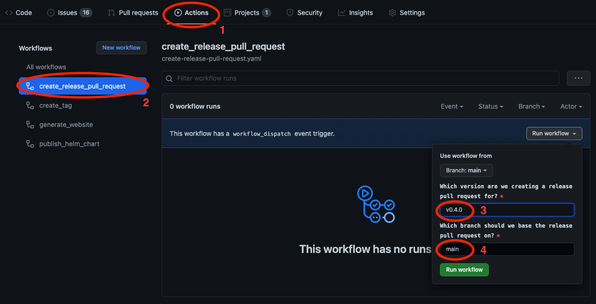
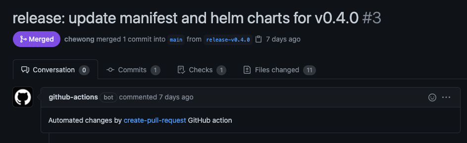
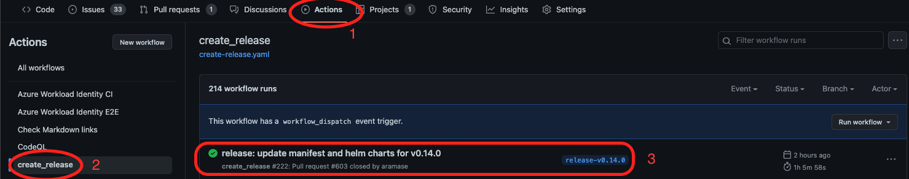
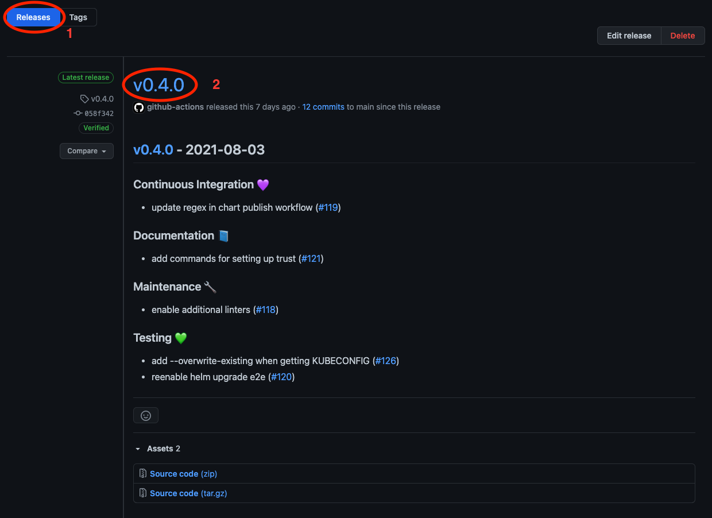

# Releasing

<!-- toc -->

We use GitHub Actions to automate our release process.

## 1. Create a release pull request

## 2. Review and approve the release pull request

## 3. Verify that the create_tag action is triggered after the release pull request is merged

## 4. Verify that the tag is successfully created

