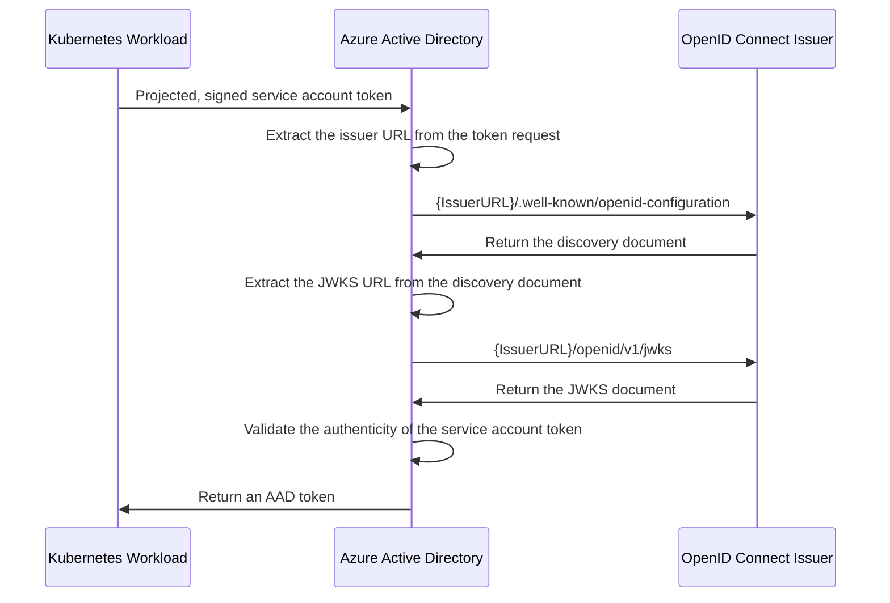

# OpenID Connect Issuer

With the Kubernetes cluster acting as a token issuer, Azure Active Directory (AAD) leverages OpenID Connect (OIDC) to discover public signing keys and verify the authenticity of the service account token before exchanging it for an AAD token. Your workload can then consume the AAD token to access Azure cloud resources via the Azure Identity SDKs or the Microsoft Authentication Library (MSAL).

In the case of self-managed clusters, administrator will have to manually publish the cluster's service account issuer URL, which should comply with the [OpenID specification][4]. The following table describes the required OIDC issuer endpoints for Azure AD Workload Identity:

| Endpoint                                            | Description                                                                                                    |
| --------------------------------------------------- | -------------------------------------------------------------------------------------------------------------- |
| [`{IssuerURL}/.well-known/openid-configuration`][1] | Also known as the OIDC discovery document. This contains the metadata about the issuer's configurations.       |
| [`{IssuerURL}/openid/v1/jwks`][2]                   | This contains the public signing key(s) that AAD uses to verify the authenticity of the service account token. |

## Sequence Diagram

<!-- source

--->

![Sequence Diagram][3]

[1]: ./oidc-issuer/discovery-document.md

[2]: ./oidc-issuer/jwks.md

[3]: ../../images/oidc-issuer-sequence-diagram.png

[4]: https://openid.net/specs/openid-connect-discovery-1_0.html
