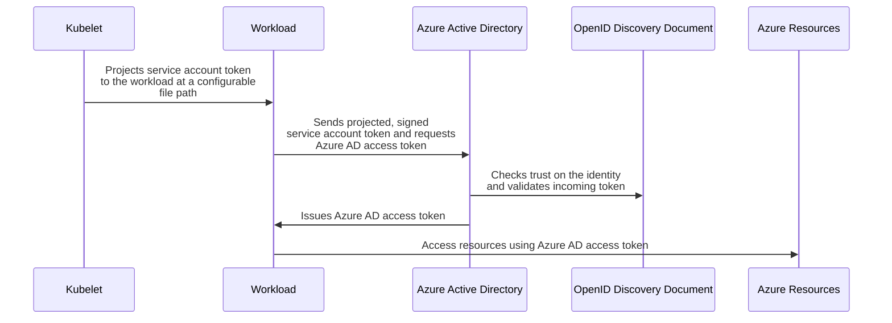

# Introduction

Workloads deployed in Kubernetes clusters require Azure AD application credentials or managed identities to access Azure AD protected resources, such as Azure Key Vault and Microsoft Graph. The [Azure AD Pod Identity][1] open-source project provided a way to avoid needing these secrets, by using Azure managed identities.

Azure AD Workload Identity for Kubernetes integrates with the capabilities native to Kubernetes to federate with external identity providers. This approach is simpler to use and deploy, and overcomes several limitations in [Azure AD Pod Identity][1]:

*   Removes the scale and performance issues that existed for identity assignment
*   Supports Kubernetes clusters hosted in **any cloud** or **on-premises**
*   Supports both **Linux** and **Windows** workloads
*   Removes the need for Custom Resource Definitions and pods that intercept [Instance Metadata Service (IMDS)][10] traffic
*   Avoids the complication and error-prone installation steps such as cluster role assignment from the previous iteration.

## Getting started

*   [Installation][2]
    *   [Managed clusters][3] or [self-managed clusters][4]
    *   [Mutating admission webhook][5]
    *   [Azure AD Workload Identity CLI (`azwi`)][6]
*   [Quick start][7]
*   [Concepts][8]

## How it works

In this model, the Kubernetes cluster becomes a token issuer, issuing tokens to Kubernetes Service Accounts. These service account tokens can be configured to be trusted on Azure AD applications or user-assigned managed identities. Workload can exchange a service account token projected to its volume for an Azure AD access token using the Azure Identity SDKs or the Microsoft Authentication Library (MSAL).

<!-- source

--->

![How it works][9]

[1]: https://github.com/Azure/aad-pod-identity

[2]: ./installation.md

[3]: ./installation/managed-clusters.md

[4]: ./installation/self-managed-clusters.md

[5]: ./installation/mutating-admission-webhook.md

[6]: ./installation/azwi.md

[7]: ./quick-start.md

[8]: ./concepts.md

[9]: ./images/how-it-works-diagram.png

[10]: https://docs.microsoft.com/en-us/azure/virtual-machines/windows/instance-metadata-service?tabs=windows
