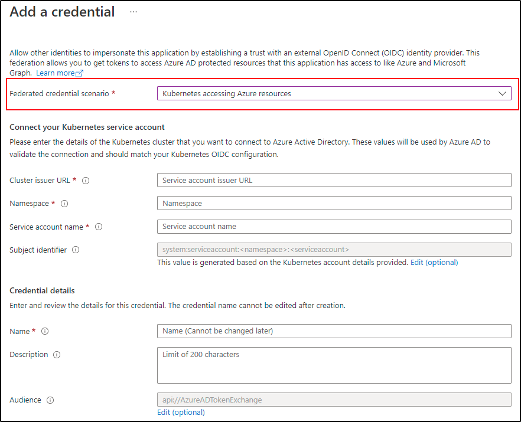
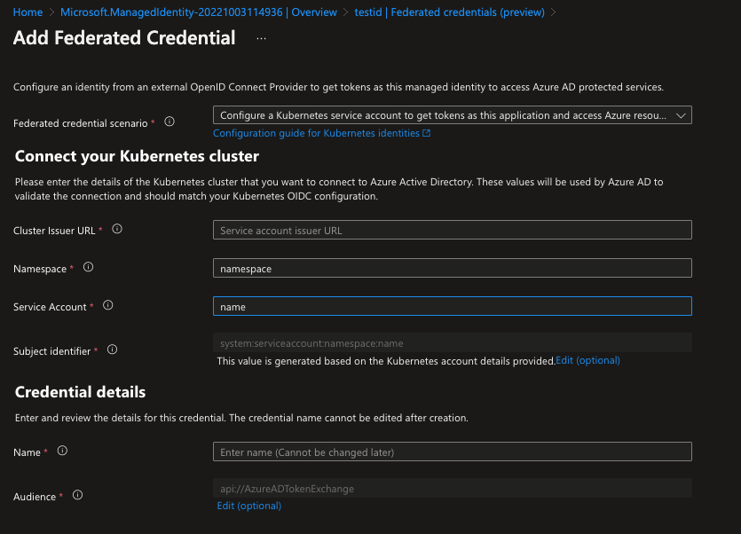

# Federated Identity Credential

<!-- toc -->

Not all service account tokens can be exchanged for a valid AAD token. A federated identity credential between an existing Kubernetes service account and an AAD application or user-assigned managed identity has to be created in advance. Refer to [doc][2] for an overview of federated identity credentials in Azure Active Directory.

> NOTE: A maximum of **20** federated identity credentials can be added per AAD application or user-assigned managed identity object. The federated identity credentials API is not available in [national cloud deployments][3] - [source][2]

Export the following environment variables:

```bash
# if you are using a Azure AD application
export APPLICATION_NAME="<your application name>"

# if you are using a user-assigned managed identity
export USER_ASSIGNED_MANAGED_IDENTITY_NAME="<your user-assigned managed identity name>"
export RESOURCE_GROUP="<your user-assigned managed identity resource group>"
```

export SERVICE_ACCOUNT_NAMESPACE="..."
export SERVICE_ACCOUNT_NAME="..."
export SERVICE_ACCOUNT_ISSUER="..." # see section 1.1 on how to get the service account issuer url
```

Currently, there are several ways to create and delete a federated identity credential:

## Azure Workload Identity CLI

> NOTE: `azwi` currently only supports Azure AD Applications. If you want to use a user-assigned managed identity, skip this section and follow the steps in the Azure CLI section.

To create a federated identity credential:

```bash
azwi serviceaccount create phase federated-identity \
  --aad-application-name "${APPLICATION_NAME}" \
  --service-account-namespace "${SERVICE_ACCOUNT_NAMESPACE}" \
  --service-account-name "${SERVICE_ACCOUNT_NAME}" \
  --service-account-issuer-url "${SERVICE_ACCOUNT_ISSUER}"
```

To delete a federated identity credential:

```bash
azwi serviceaccount delete phase federated-identity \
  --aad-application-name "${APPLICATION_NAME}" \
  --service-account-namespace "${SERVICE_ACCOUNT_NAMESPACE}" \
  --service-account-name "${SERVICE_ACCOUNT_NAME}" \
  --service-account-issuer-url "${SERVICE_ACCOUNT_ISSUER}"
```

## Azure CLI

A federated identity credential can also be created using the `az` CLI. This can either be done in a local terminal session, or using [Azure Cloud Shell][1]. Use the `az` CLI to run the following commands:

### Federated identity credential for an Azure AD application

```bash
# Get the object ID of the AAD application
export APPLICATION_OBJECT_ID="$(az ad app list --display-name "${APPLICATION_NAME}" --query '[0].id' -otsv)"

cat <<EOF > params.json
{
  "name": "kubernetes-federated-identity",
  "issuer": "${SERVICE_ACCOUNT_ISSUER}",
  "subject": "system:serviceaccount:${SERVICE_ACCOUNT_NAMESPACE}:${SERVICE_ACCOUNT_NAME}",
  "description": "Kubernetes service account federated identity",
  "audiences": [
    "api://AzureADTokenExchange"
  ]
}
EOF

az ad app federated-credential create --id $APPLICATION_OBJECT_ID --parameters params.json
```

To delete a federated identity credential, the federated identity credential ID needs to be obtained with the following command:

```bash
az ad app federated-credential list --id "${APPLICATION_OBJECT_ID}"
```

Select the desired ID of the federated identity credential and run the following command:

```bash
az ad app federated-credential delete --federated-credential-id $FIC_ID --id $APPLICATION_OBJECT_ID
```

### Federated identity credential for a user-assigned managed identity

```bash
az identity federated-credential create \
  --name "kubernetes-federated-identity" \
  --identity-name "${USER_ASSIGNED_MANAGED_IDENTITY_NAME}" \
  --resource-group "${RESOURCE_GROUP}" \
  --issuer "${SERVICE_ACCOUNT_ISSUER}" \
  --subject "system:serviceaccount:${SERVICE_ACCOUNT_NAMESPACE}:${SERVICE_ACCOUNT_NAME}"
```

To delete a federated identity credential 

```bash
az identity federated-credential delete \
  --identity-name "${USER_ASSIGNED_MANAGED_IDENTITY_NAME}" \
  --name "kubernetes-federated-identity" \
  --resource-group "${RESOURCE_GROUP}"
```

For more information on the `az identity federated-credential` command, refer to the [Azure CLI documentation][4].

## Azure Portal UI

### Federated identity credential for an Azure AD application

1. Sign in to the [Azure portal](https://portal.azure.com). 
1. Go to **App registrations** and open the app you want to configure.
1. Go to **Certificates and secrets**. 
1. In the **Federated credentials** tab, select **Add credential**. The **Add a credential** blade opens.
1. In the **Federated credential scenario** drop-down box select **Kubernetes accessing Azure resources**.
1. Specify the **Cluster issuer URL**.
1. Specify the **Namespace**.
1. Specify the **Service account name**.
1. The **Subject identifier** field auto-populates based on the values you entered.
1. Add a **Name** for the federated credential.
1. Click **Add** to configure the federated credential.



### Federated identity credential for a user-assigned managed identity

1. Sign in to the [Azure portal](https://portal.azure.com). 
1. Go to resource group and open the user-assigned managed identity you want to configure.
1. Go to **Federated credentials**.
1. In the **Federated credentials** tab, select **Add credential**. The **Add a credential** blade opens.
1. In the **Federated credential scenario** drop-down box select **Kubernetes accessing Azure resources**.
1. Specify the **Cluster issuer URL**.
1. Specify the **Namespace**.
1. Specify the **Service account name**.
1. The **Subject identifier** field auto-populates based on the values you entered.
1. Add a **Name** for the federated credential.
1. Click **Add** to configure the federated credential.



[1]: https://portal.azure.com/#cloudshell/

[2]: https://docs.microsoft.com/en-us/graph/api/resources/federatedidentitycredentials-overview?view=graph-rest-beta&preserve-view=true

[3]: https://docs.microsoft.com/en-us/graph/deployments

[4]: https://learn.microsoft.com/en-us/cli/azure/identity/federated-credential?view=azure-cli-latest
